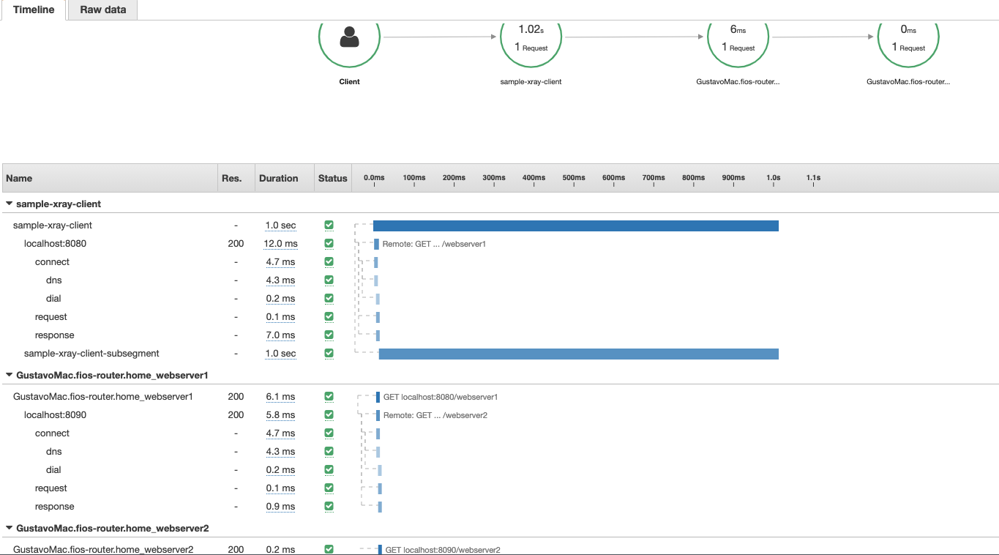

# XRay tracing setup

## Prerequisites

### Package

`github.com/aws/aws-xray-sdk-go`

### Local Development

See [setting up xray daemon](#setting-up-xray-container-for-local-use)

## Sample result



## Initializing platform plugin

```go
tracingConfig := tracing.NewConfig()
tracingConfig.HostPlatform = "ecs"
tracing.Configure(tracingConfig)
```

## Instrumenting a Server (platform-common-lib)

```go
import (
   "gitlab.kksharmadevdev.com/platform/platform-common-lib/src/v6/tracing"
   "gitlab.kksharmadevdev.com/platform/platform-common-lib/src/v6/web"
)

tracingConfig := tracing.NewConfig()
server := web.Create(&web.ServerConfig{ListenURL: ":8080", TracingConfig: tracingConfig})
server.Start(ctx)

```

## Instrumenting a Server (base)

```go
import "gitlab.kksharmadevdev.com/platform/platform-common-lib/src/v6/tracing"

router := mux.NewRouter()
tracingConfig := tracing.NewConfig()
handler, err := tracing.WrapHandlerWithTracing(tracingConfig, router)
// check(err)
http.ListenAndServe(":8080", handler)

```

## Instrumenting a Client (platform-common-lib)

```go
import (
   "gitlab.kksharmadevdev.com/platform/platform-common-lib/src/v6/tracing"
   "gitlab.kksharmadevdev.com/platform/platform-common-lib/src/v6/webClient"
)

tracingConfig := tracing.NewConfig()
config := webClient.ClientConfig{}
config.TracingConfig = tracingCfg
factory := webClient.ClientFactoryImpl{}
client := factory.GetClientServiceByType(webClient.BasicClient, config)

...

tracingConfig := tracing.NewConfig()
server := web.Create(&web.ServerConfig{ListenURL: ":8080", TracingConfig: tracingConfig})

```

## Instrumenting a Client (base)

```go
import (
   "gitlab.kksharmadevdev.com/platform/platform-common-lib/src/v6/tracing"
)

tracingConfig := tracing.NewConfig()
client := &http.Client{}
client, err := tracing.HTTPClient(tracingConfig, client)
// check(err)

```

## Instrumenting an AWS Client

```go
import (
	"context"
	"log"
	"github.com/aws/aws-sdk-go-v2/aws"
	"github.com/aws/aws-sdk-go-v2/config"
	"github.com/aws/aws-sdk-go-v2/service/dynamodb"
	"github.com/aws/aws-xray-sdk-go/instrumentation/awsv2"
	"github.com/aws/aws-xray-sdk-go/xray"
)

	cfg, err := config.LoadDefaultConfig(ctx, config.WithRegion("us-east-1"))
	if err != nil {
		log.Fatalf("unable to load SDK config, %v", err)
	}
	// Instrumenting AWS SDK v2
	awsv2.AWSV2Instrumentor(&cfg.APIOptions)
	// Using the Config value, create the DynamoDB client
	svc := dynamodb.NewFromConfig(cfg)
	// Build the request with its input parameters
	_, err = svc.ListTables(ctx, &dynamodb.ListTablesInput{
		Limit: aws.Int32(5),
	})
	if err != nil {
		log.Fatalf("failed to list tables, %v", err)
	}

```

## Custom tracing (capture, metadata, and annotation)

> NOTE: any manually started segments need to be manually closed

```go
import (
   "gitlab.kksharmadevdev.com/platform/platform-common-lib/src/v6/tracing"
)

ctx, cancel := context.WithCancel(context.Background())
defer cancel()
ctx, seg := xray.BeginSegment(ctx, "sample-xray-client")
metadata := struct{ Hello string }{Hello: "world"}
tracing.AddMetadata(ctx, "metadata", metadata) // any object
tracing.AddAnnotation(ctx, "annotation", "hello world") // kv pair
// use ctx for http client or custom code capture
tracing.Capture(ctx, "sample-xray-client-subsegment", func(ctx context.Context) error {
      <-time.After(1 * time.Second)
      return nil
})
seg.Close(err) // send to daemon

```

## Setting up xray container for local use

> Note: this assumes you already have your `.aws/credentials` pre-configured and that you have xray access for your account

### Build Xray docker image

```bash
docker build -f XRay.Dockerfile -t xray-daemon .
```

### Run xray daemon

```bash
docker run \
      --attach STDOUT \
      -v ~/.aws/:/root/.aws/:ro \
      -e AWS_REGION=us-east-1 \
      --name xray-daemon \
      -p 2000:2000/udp \
      xray-daemon -o
```

### Stop xray daemon

```bash
docker stop xray-daemon
```

### Remove xray daemon

```bash
docker rm xray-daemon
```
